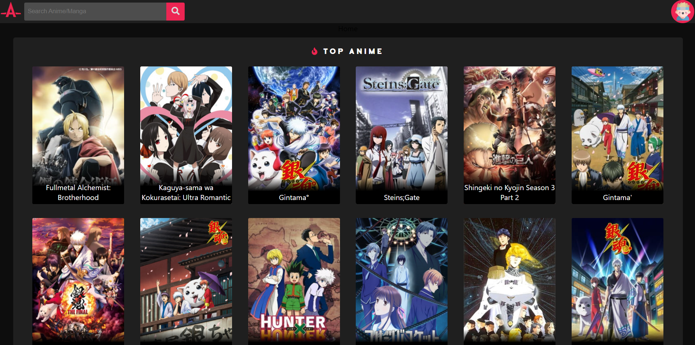
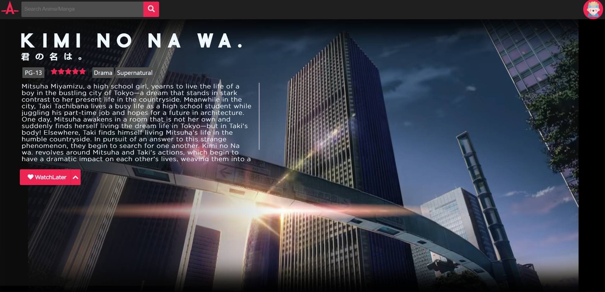
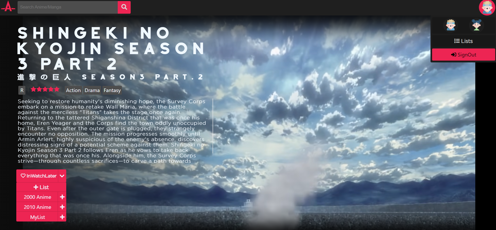

    
 

 
  
  <a  href="https://animtrack-de50d.web.app/">View live website</a>
  
Loading may take some time as its heroku policy to put app on sleep if there is no traffic and it takes a little while(5-6 secs) to put things back on work

 

# About The Project

The only objective to create this web-app was to learn redux-tools, React & state management, creating server using Express, MongoDB queries etc.

## Built With
* [React](https://reactjs.org/)
* [redux](https://redux.js.org/introduction/getting-started)
* [MongoDB](https://github.com/abhishekshakya/MERN-frontend-Ecomm/blob/main/mongodb.com)
* [Express](https://expressjs.com/)
* [Back-End Repo](https://github.com/shreytanwar/AnimTrack-Back-End)

## Screenshots
* Home Screen

* Detail Page

* Sign In/ Register to save to your custom lists

### Things To Do
- [x] Authentication System usign webTokens
- [x] Fetch user authentication on every page relod
- [x] Proper iframe setup
- [x] Functional Searchbar
- [x] Redux store for search results and current item
- [x] Initial Loading animation while data loads
- [ ] Create View for user's lists

 
See the <a align="center" href="https://github.com/shreytanwar/AnimTrack-Front-End/issues">open issues</a> for a list of proposed features (and known issues).
